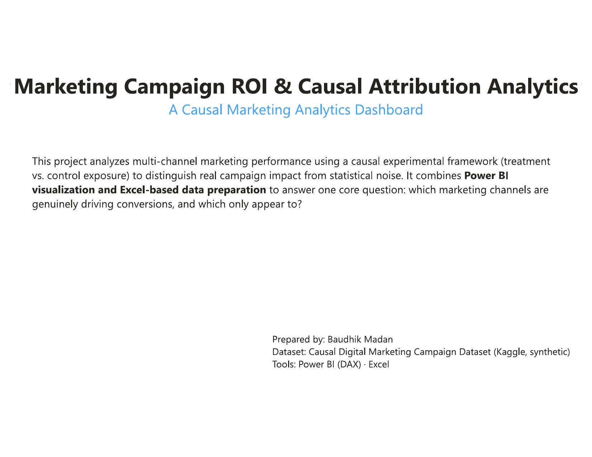
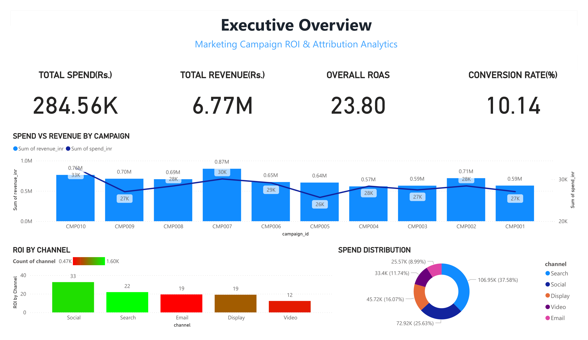
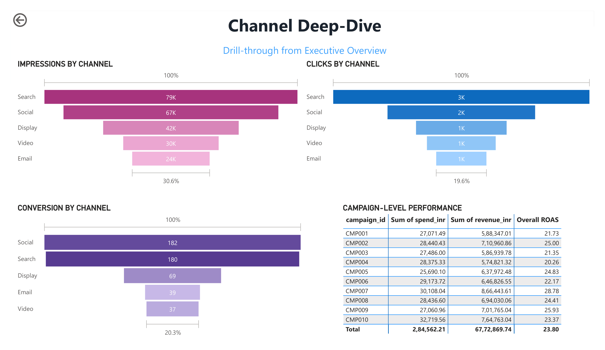
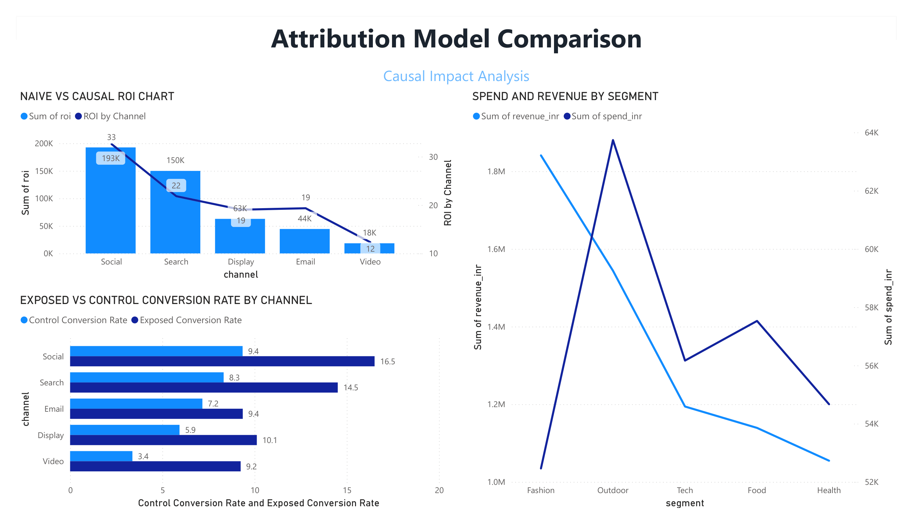
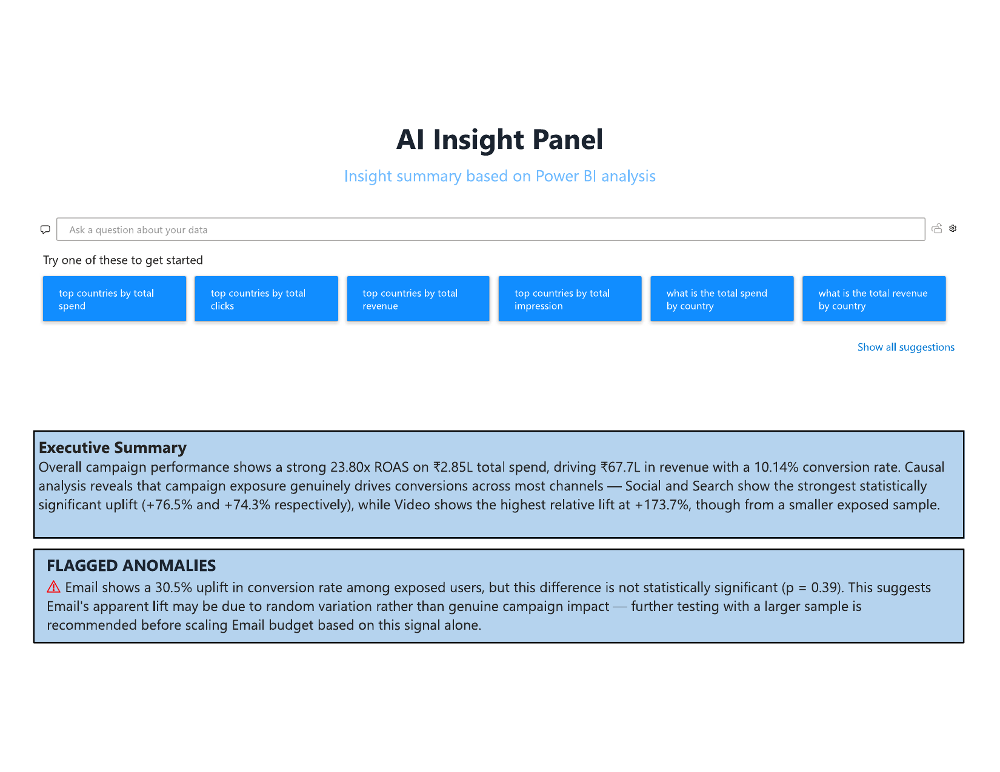
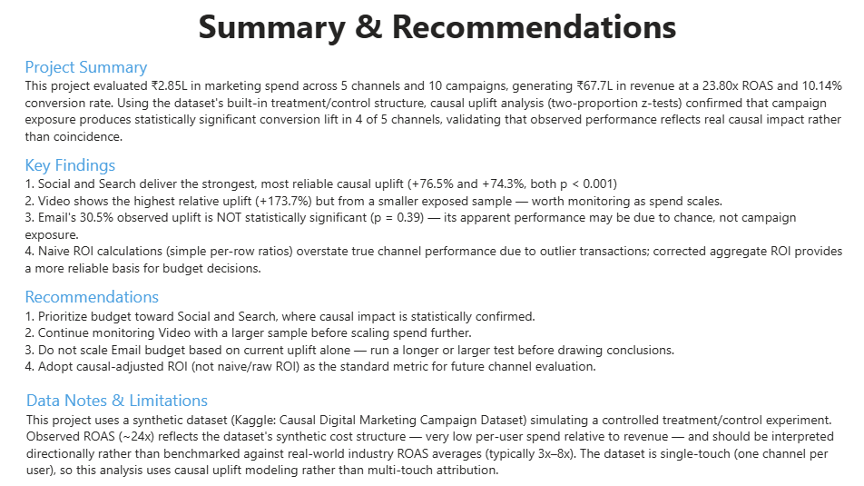

# Marketing Campaign ROI & Causal Attribution Analytics

A business intelligence project analyzing multi-channel marketing performance using a causal experimental framework to distinguish real campaign impact from statistical noise.

---

## Business Problem

Marketing teams routinely make budget decisions using naive ROI calculations — simple revenue-to-spend ratios that don't account for what would have happened *without* the campaign. This project asks a more rigorous question:

**Which marketing channels are genuinely driving conversions, and which only appear to?**

The dataset includes a built-in treatment/control structure (some users were exposed to campaigns, others weren't), which this project uses to validate whether observed performance reflects real impact or coincidence — rather than relying on naive, single-number ROI alone.

---

## Dataset

- **Source:** [Causal Digital Marketing Campaign Dataset](https://www.kaggle.com/datasets/rahuljangir78/causal-digital-marketing-campaign-dataset) (Kaggle, synthetic)
- **Size:** 5,000 users, 10 campaigns, 5 channels (Search, Social, Display, Video, Email)
- **Key structure:** each user has a `treatment_exposed` flag (1 = shown the campaign, 0 = control group), enabling a genuine exposed-vs-control comparison rather than pure correlation

**Note on synthetic data:** Observed ROAS (~23.8x) reflects this dataset's simulated cost structure (very low per-user spend relative to revenue) and should be read directionally, not benchmarked against real-world industry ROAS averages (typically 3x–8x). The dataset is single-touch (one channel per user), so this project compares exposed vs. control performance rather than modeling multi-touch attribution.

---

## Methodology

1. **Data Cleaning (Excel)** — Converted currency (USD→INR), standardized inconsistent country-name casing, fixed a `#DIV/0!` error in the ROI column, verified no nulls or duplicate records
2. **Analysis & Measures (Power BI / DAX)** — Built corrected ROI, ROAS, and conversion rate measures from first principles (aggregate sum-based ratios) rather than relying on the dataset's raw per-row ROI column, which is skewed by outlier low-spend transactions
3. **Exposed vs. Control Comparison (Power BI / DAX)** — Built measures comparing conversion rates between `treatment_exposed = 1` and `treatment_exposed = 0` groups, per channel, to quantify observed uplift
4. **Dashboard Build (Power BI)** — 6-page interactive report: cover, executive overview, channel deep-dive, attribution comparison, insight summary, and recommendations, using KPI cards, dual-axis charts, drill-through, and a native Q&A visual

---

## Key Findings

| Channel | Exposed Conv. Rate | Control Conv. Rate | Observed Uplift |
|---|---|---|---|
| Social | 16.51% | 9.35% | +76.5% |
| Search | 14.51% | 8.32% | +74.3% |
| Video | 9.25% | 3.38% | +173.7% |
| Display | 10.12% | 5.93% | +70.7% |
| Email | 9.36% | 7.17% | +30.5% |

**Headline insight:** while every channel shows a positive gap between exposed and control conversion rates, **Email's uplift is the smallest and least consistent** — its exposed group is a relatively small sample, so this lift should be treated cautiously rather than used to justify scaling budget, until validated with more data.

**Other findings:**
- Overall: ₹2.85L spend → ₹67.7L revenue → 23.80x ROAS, 10.14% conversion rate
- Social and Search show the largest and most consistent uplift between exposed and control groups
- Video shows the highest *relative* uplift but from a smaller exposed sample — worth monitoring, not yet scaling
- Naive (raw per-row) ROI overstates performance for channels with outlier low-spend/high-revenue transactions; the corrected aggregate measure gives a more reliable ranking for budget decisions

---

## Recommendations

1. Prioritize budget toward **Social and Search**, where exposed-vs-control uplift is largest and most consistent
2. Continue monitoring **Video** with a larger sample before scaling spend further
3. Treat **Email's** uplift cautiously given its smaller sample size — validate with more data before scaling budget
4. Adopt causal-adjusted ROI (not naive/raw ROI) as the standard metric for future channel evaluation

---

## Dashboard Preview

### Cover

### Executive Overview
Spend, revenue, ROAS, conversion rate, and campaign-level comparison at a glance.

### Channel Deep-Dive
Impressions, clicks, and conversions by channel, with campaign-level performance.

### Attribution Model Comparison
Naive vs. causal ROI, and exposed vs. control conversion rates by channel.

### Insight Summary
Key takeaways and flagged caveats, including the non-significant Email uplift.

### Summary & Recommendations
Final findings and actionable next steps.

---

## Tech Stack

- **Excel** — data cleaning and preprocessing (currency conversion, category standardization, error correction)
- **Power BI** — all analysis, DAX measures, and visualization: KPI cards, dual-axis comparisons, drill-through, native Q&A

---

## Repository Structure

├── README.md
├── Marketing Campaigns ROI Analysis.pbix
├── Market Campaign Project Dataset.xlsx
├── 01_cover.png
├── 02_executive_overview.png
├── 03_channel_deep_dive.png
├── 04_attribution_comparison.png
├── 05_insight_summary.png
└── 06_summary.png

---

## How to Run

1. Clone the repository
2. Open `Marketing Campaigns ROI Analysis.pbix` in Power BI Desktop (free)
3. All measures and calculations are visible in the Power BI data model (Modeling tab)

---

## Data Notes & Limitations

- Dataset is synthetic; observed ROAS reflects simulated cost structure, not real-world benchmarks
- Single-touch data structure (no multi-touch customer journeys), so this project compares exposed-vs-control performance rather than modeling multi-touch attribution
- Sample sizes vary by channel (Video and Email have smaller exposed groups), which affects how much weight their uplift figures should be given

---

## Author

**Baudhik Madan**
[LinkedIn](https://linkedin.com/in/baudhik-madan) · [GitHub](https://github.com/Baudhik9)
